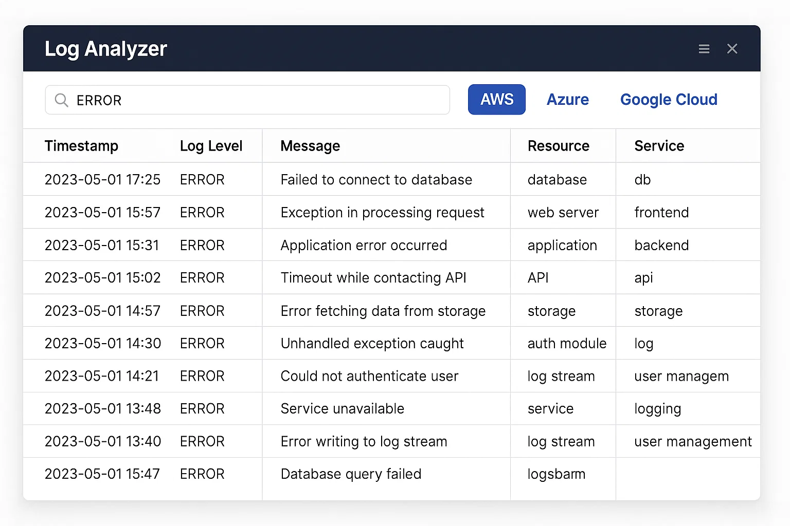

# Overview 
Hi there! 👋

This repository contains a fake project to demonstrate technical writing and documentation skills. Everything below the Overview section is made up, which means the links won't go anywhere and you won't be able to actually install anything.

## Log Analyzer Tool - Overview
Log Analyzer is a simple tool for security engineers and cloud administrators to analyze large volumes of security logs for common patterns:

* Impossible travel detections
* Multiple failed login attempts
* Suspicious IP addresses
* Privilege escalation events

The tool supports logs from:

✅ AWS CloudTrail <br>
✅ Azure Activity Logs <br>
✅ GCP Cloud Audit Logs


## Getting Started
To install this tool, you'll need Python 3.9 or newer, and the following requirements.txt file. 

> [!INFO]  This guide does not cover installing Python. Please visit the official Python site: https://www.python.org/ to download and install for your particular Operating System.

```
# Log parsing library
logparser==1.2.3

# IP reputation lookup utility
iplookup==0.4.1

# AWS CloudTrail analysis module
cloudtrail-analyzer==2.0.0

# Geolocation mapping tool
geoip-mapper==0.9.8

# Report generation library (CSV / HTML)
reportgen==3.5.7
```

## User Interface

